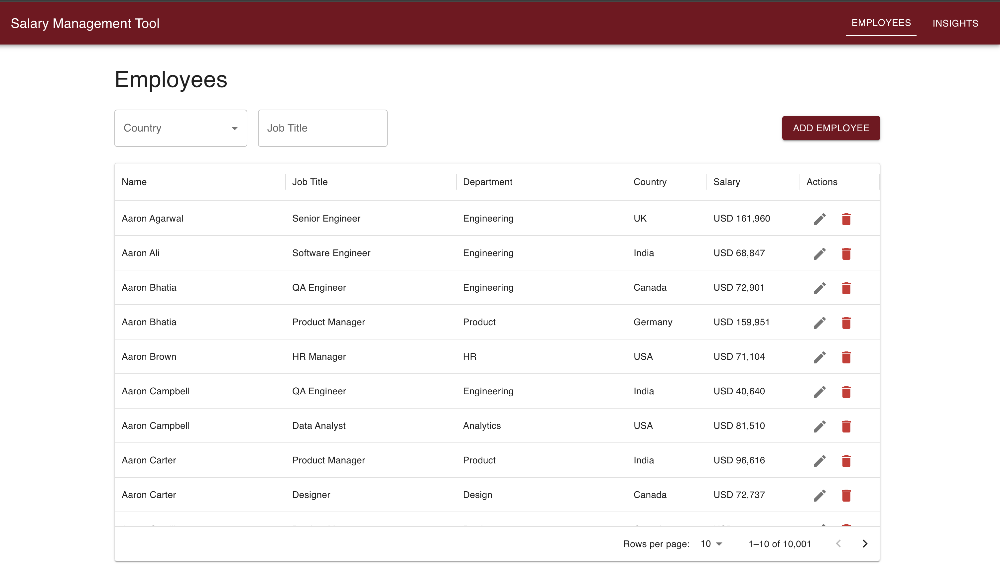
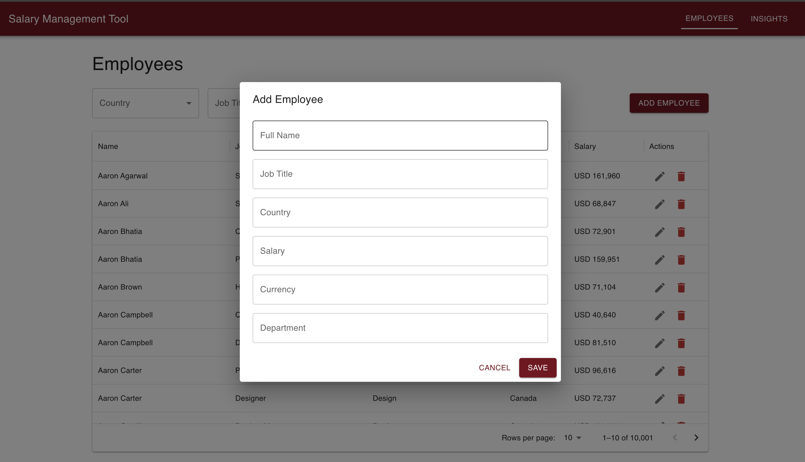
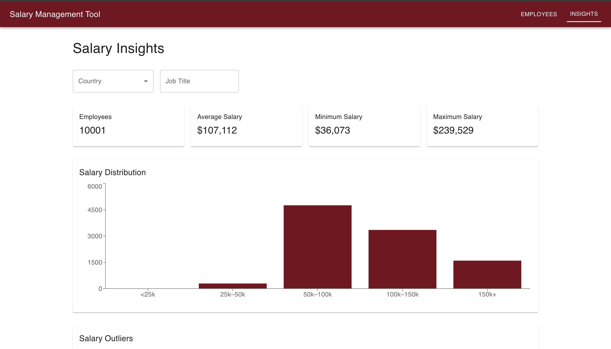

# Salary Management Tool


Application URL: [https://salary-managment-gilt.vercel.app](https://salary-managment-gilt.vercel.app)

A full-stack salary management and HR analytics platform built as an engineering assessment project. The application enables HR managers to manage employee records and gain actionable salary insights across departments, job titles, and countries.

---

# Highlights

- Full-stack monorepo architecture
- Rails 8 API-only backend
- Next.js 16 + TypeScript frontend
- Salary analytics dashboard with charts
- Server-side pagination, filtering, and sorting
- Optimized seed script for 10,000 employees
- Clean separation of business logic using service objects
- Production deployment with Railway + Vercel
- TDD-driven development approach
- AI-assisted engineering workflow

---

# Project Overview

The Salary Management Tool is an internal HR platform that allows organizations to:

- Manage employee records
- Analyze salary trends
- Identify salary outliers
- Compare compensation across countries and job titles

The project was intentionally designed with a balance of:
- product usability
- clean architecture
- scalable backend patterns
- maintainable frontend structure

---

# Features

## Employee Management

- Create employees
- View employees
- Update employees
- Delete employees
- Server-side pagination
- Filtering by:
  - country
  - job title
- Sorting support

## Salary Insights

- Minimum salary
- Maximum salary
- Average salary
- Employee count
- Salary distribution visualization
- Salary outlier detection
- Country-based analytics
- Job title-based analytics
- Paginated outliers table

---

# Tech Stack

## Backend

- Ruby on Rails 8 (API-only)
- PostgreSQL (production)
- SQLite (development)
- RSpec
- FactoryBot
- Faker

## Frontend

- Next.js 16
- TypeScript
- Material UI
- MUI DataGrid
- Recharts
- Axios

## Deployment

- Backend: Railway
- Frontend: Vercel

---

# Architecture Overview

```text
Frontend (Next.js)
        ↓
 REST API Communication
        ↓
Backend (Rails API)
        ↓
 PostgreSQL Database
```

### Design Principles

- Thin controllers
- Service-oriented business logic for analytics
- Server-side data operations
- Scalable pagination/filtering patterns
- Separation of UI and API concerns

---

# Monorepo Structure

```text
salary-management-tool/
│
├── backend/
├── frontend/
└── README.md
```

---

# Setup Instructions

## Backend Setup

```bash
cd backend
bundle install
rails db:create
rails db:migrate
rails db:seed
rails server
```

Backend runs on:

```text
http://localhost:3000
```

---

## Frontend Setup

```bash
cd frontend
npm install
npm run dev
```

Frontend runs on:

```text
http://localhost:3001
```

---

# Environment Variables

## Frontend `.env.local`

```env
NEXT_PUBLIC_API_BASE_URL=http://localhost:3000
```

---

# Running Tests

## Backend Tests

```bash
bundle exec rspec
```

Includes:
- model specs
- request specs
- service specs

---

# API Overview

## Employees

```http
GET /employees
POST /employees
PATCH /employees/:id
DELETE /employees/:id
```

## Insights

```http
GET /insights/salary-summary
GET /insights/distribution
GET /insights/outliers
```

Example:

```http
GET /employees?page=1&per_page=10&country=India
```

---

# Key Engineering Decisions

## Why Rails API-only?

Using Rails API-only mode reduced unnecessary middleware and aligned the backend architecture with a frontend-driven SPA application.

## Why Service Objects Only for Insights?

CRUD operations were intentionally kept simple inside controllers to avoid unnecessary abstraction.

Service objects were introduced specifically for:
- salary analytics
- distribution calculations
- outlier detection

This kept business logic isolated while avoiding overengineering for straightforward CRUD operations.

## Why Server-side Pagination?

The system is designed for 10,000+ employees. Server-side pagination/filtering ensures:
- smaller payloads
- faster rendering
- scalable API patterns

---

# Trade-offs & Decisions

| Decision | Reason |
|---|---|
| SQLite in development | Faster local setup |
| PostgreSQL in production | Better production compatibility |
| API-only Rails backend | Cleaner separation of concerns |
| Service layer only for insights | Avoid unnecessary abstraction |
| Monorepo structure | Easier assessment submission and management |
| Material UI | Faster development with consistent UX |
| Recharts | Lightweight charting solution |

---

# Performance Considerations

- Optimized seed generation using batch inserts
- Server-side pagination/filtering
- Lightweight API responses
- Analytics logic scoped through query filtering

---

# AI-Assisted Development Approach

AI tools were intentionally used throughout development to accelerate:
- implementation planning
- architecture validation
- test generation
- UI refinement
- debugging workflows

All generated code and suggestions were manually reviewed and validated to ensure correctness and maintainability.

---

# Future Improvements

- Authentication & authorization
- Role-based access control
- CSV import/export
- Advanced salary benchmarking
- Audit logs
- Caching for analytics endpoints
- Docker-based local setup
- CI/CD pipelines

---

# Deployment

## Live Application

Frontend:
```text
https://salary-managment-gilt.vercel.app/
```

Backend API:
```text
https://salary-managment-production.up.railway.app
```

---

# Screenshots

<kbd></kbd>
<kbd></kbd>
<kbd></kbd>

---

# License

This project was developed as part of an engineering assessment submission and is intended for evaluation purposes only.
